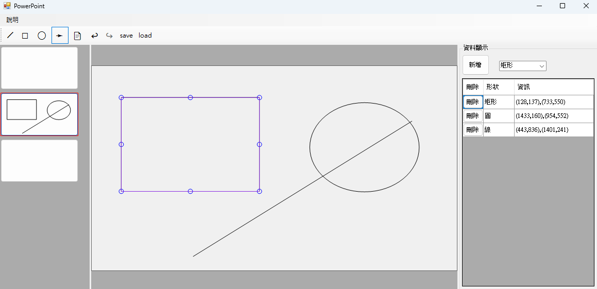

# 2023視窗程式設計專案
此專案為
<a herf="https://woeikaechen.synology.me/wkc/">
    2023年北科大資工系視窗程式設計
</a>
課程的回家作業，藉由Windows 視窗程式來學習基本design pattern 的實作。

## Installation
本專案使用
<a herf="https://woeikaechen.synology.me/wkc/">
visual studio 2019 Community
</a>
進行開發(感謝陳偉凱老師的安裝教學)
，另外也可使用JetBrains Rider，需另外下載
<a herf="https://dotnet.microsoft.com/en-us/download/visual-studio-sdks">
.NET Framework 4.7.2
</a>。

### 檔案結構
   ```
   PowerPoint/
   │
   ├── WindowsFormsApp1/
   │   ├── View/
   │   └── ModelObject/
   │
   ├── WindowsFormsApp1Tests1/
   │
   └─── WindowsFormsApp1UITests/
   ```
#### WindowsFormsApp1
存放所有source code，按照MVC pattern，
View 內部存放所有和UI顯示有關的部分，
而ModelObject 則是包含所有邏輯以及存放資料的部分

#### WindowsFormsApp1Tests1
包含除了View 之外所有Class 的Unit Test。

#### WindowsFormsApp1UITests
透過selenium 來實現的自動化UI測試

## Usage

### UI



### 繪圖
1. 按下上方工具欄的 `╱`/`☐`/`○`按鈕後，可以在中央畫布上分別畫出線/矩形/橢圓。
2. 從右側下拉選單選擇圖形後，按下新增按鈕後會出現輸入框輸入座標，即可按照座標新增圖形。
3. 當選擇到上方工具欄的`➛`時，從畫布上點擊某個圖形後出現選取框，即可按住滑鼠左鍵移動圖形，或是按住四個角拖動改變圖形大小。
4. 當選擇到圖形時可以按下鍵盤`del`鍵或是右側列表前的刪除按鈕來刪除圖行。

### 頁面
1. 按下上方工具欄的 `📄`來新增頁面。
2. 點擊右側任意頁面即可切換。
3. 對右側頁面按下鍵盤`del`鍵可以刪除頁面。

### Redo/Undo
繪圖和頁面的所有操作都可以透過按下上方工具欄的 `↩︎`/`↪︎`按鈕來Redo/Undo。

### 存/讀檔
1. 按下上方工具欄的 `save` 可以把現在狀態儲存到雲端硬碟。
2. 按下上方工具欄的 `load` 可以把雲端硬碟的檔案載入下來。

### 頁面自適應
頁面左中右三部分和整個視窗可以自由調逞大小。


[//]: # (## Contributing)

[//]: # (## License)